# NADMO 登录与更新教程
> 数码宝贝大师北美服（原国际服）国人群：606731979 

## 节点管理
- 下载 [v2rayN](https://github.com/2dust/v2rayN/releases/download/6.45/v2rayN-With-Core.zip)，解压并启动 
- 购买节点
    - 从 v2rayN 中的“推广”中选择适合你的

        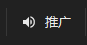
    - 其他任意能用于后续登录的节点
- 增加订阅
    - 节点网站复制订阅链接
    - 填入“别名”和“可选地址”（订阅链接），然后点击确定

        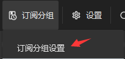 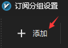

        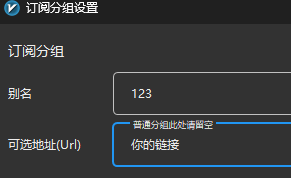
    - 更新订阅

        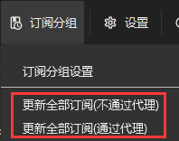
- 右键选择合适的节点 

    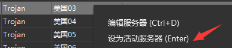
- 路由：全局

    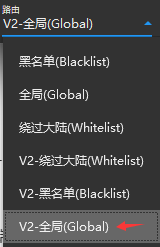

## DMO 代理
- 下载安装 [Proxifier](download/ProxifierSetupV4.11.exe)，激活码:
PFH9R-4WMUS-FQF2H-DR01D-NJRE3
- 设置本地代理服务器

    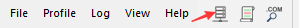 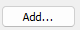

    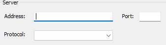
    - 分别填入
        - Address: 127.0.0.1
        - Port：v2rayN 的本地 socks 端口号（默认是10808）
        - Protocol: SOCKS V5
- 设置本地代理规则
    - 打开规则 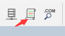
    - 新增规则 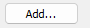
    - 设置规则 
        - Name: 任意填写 

            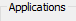
        - Applications: 
            - 用于登录游戏就填写：gdmo.exe

            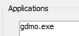
            - 用于更新游戏就填写（比较废流量）：dmlauncher.exe

            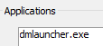            
            - 也可以同时填写
            
            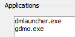
        - Action: Proxy 

            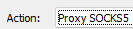
        - 点击 OK 

            

## 爽玩
如题