# NADMO 登录与更新教程

> 使用条款：本教程仅供数码宝贝大师北美服务器游戏之目的，严禁将其用于任何违反当地法律法规的行为。任何偏离教程指引的设置操作均与本教程无关，因此所造成的一切后果也与本教程无关。使用本教程即表示您已阅读并同意遵守上述条款。

## 节点
- 下载 [v2rayN](https://github.com/2dust/v2rayN/releases/download/6.45/v2rayN-With-Core.zip)，解压并启动 
- 安装 .Net Framework(dotnet-sdk)，启动 v2rayN 时会自动打开网页下载
- 购买节点
    - 从 v2rayN 中的“推广”中选择适合你的

        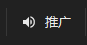
    - 其他任意能用于后续登录的节点
- 增加订阅
    - 节点网站复制订阅链接
    - 填入“别名”和“可选地址”（订阅链接），然后点击确定

        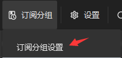 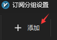

        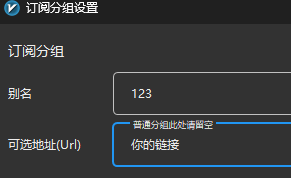
    - 更新订阅

        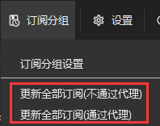
- 右键选择合适的节点 

    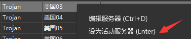
- 路由：全局

    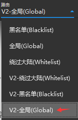

## DMO 数据转发
- 下载安装 [Proxifier](/download/ProxifierSetupV4.11.exe)，激活码:
PFH9R-4WMUS-FQF2H-DR01D-NJRE3
- 设置本地代理服务器

    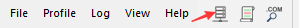 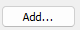

    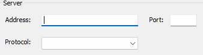
    - 分别填入
        - Address: 127.0.0.1
        - Port：v2rayN 的本地 socks 端口号（默认是10808）
        - Protocol: SOCKS V5
- 设置本地代理规则
    - 打开规则 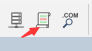
    - 新增规则 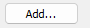
    - 设置规则 
        - 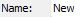 任意填写
        - 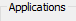
            - 用于登录游戏：
            
                
            - 用于更新游戏（比较费流量）：
                
                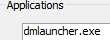  
            - 也可以同时填写，或新增多条规则：
                
                
        - 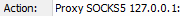
        - 点击 
